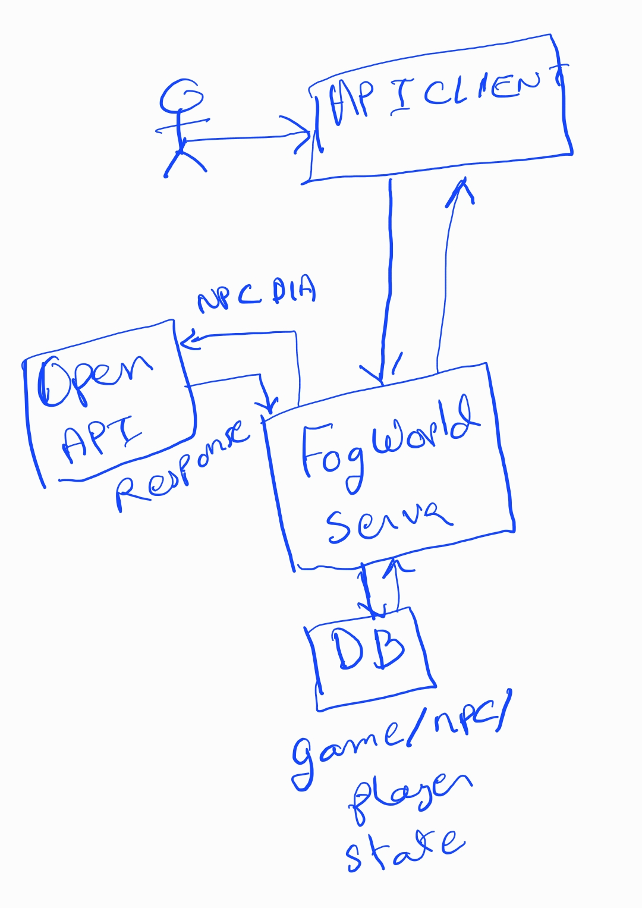

## Fog world Architecture

### Welcome to Fogworld architecture document. 

This document is meant to document design decisions and guide overall system design for Fogworld.

### Architecture Overview

## Major Architecture Blocks

### API Client

Software component that the user is going to interact with. This will be a mobile app.

### Fog World Server

Software component responsible for managing login, balancing user state and communicating with external applications. 

### DB block

- Relational Database: Handle player, npc state. 
- NoSQL Database: Keeps track of NPC and player dialogue.

### Future Improvements